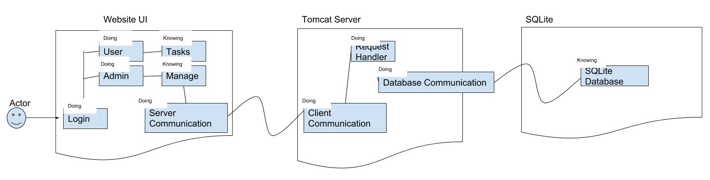

Group Project Design
======================

Introduction
---------------------
Due to increase in the complexity of projects, it has become increasingly important for today’s corporations to optimize their workload and available resources to effectively achieve their project goals. The goal of our project is to create a task management web application for corporations to manage their projects, meet deadlines, track their progress on approved projects, prioritize their projects to effectively use available resources and budget or time to complete their projects, share feedback on projects and associated tasks.  The main user of this web application will be ultimately corporations with distributed and dynamic usage of this web app across different teams within those corporations . This web app will allow the employees to propose certain task with its priority, start and estimated stop dates, description, and much more attributes, which then will be approved and assigned appropriately by managers. This web app will allow all users to track their progress on their respective projects as well as team and the whole corporation projects.

Product Review
---------------

***Task Manager (2do - iOS App)***
* Purpose: to help manage everyday tasks in an easy-to-understand calendar based format
    - tasks can be split into different categories (ie work, school, etc)
* View: Calandar screen which allows you to navigate days and edit tasks per that day
    - Create, edit, begin/end task
    - Main display shows task title. Once title is clicked, all necessary info is displayed
* Relation to Project: Gives us an idea of how to separate our tasks by company

***Recorder (Android app)***
* Purpose: to record sounds, contains option for recording sound in different environment
    - normal, meeting, interview, concert mode setting
* View: simple user interface with 3 main sections
    - 3 bottons start, save, and recordings to look at old saved files
    - displays running time and sound activity
* Saved File: displayed as blockes that contains file name, date recorded, and length of recording.
* Relation to Project: ideas for designing a simple interface

***Github (web page)***
* Purpose: file host for people working together
* Github keeps track of user activity, repositories created and contributed to, and teams user are in.
* contains access rights (private and public repositories)
* branching, merging, and commit functions

***Google Calendar (web/app)***
* Purpose: calendar to keep track of events
* View: contains day, week, month, and year view of calendar
* Functions: allows user to add events to calendar, keeps track of time on user device
    - events can be given name and description
    - allows user to set event duration (start date and end date)
    - allows user to set reminders, birthdays, and holidays

Project Overview
----------------
Taking into consideration the functionality of the google calendar app and a task managing app, it would be great for employees in a company to have a task managing system like the google calendar. They would have similar functions like the google calendar as well as a task timing functions to help manage their work.  

* Task organizer for the average employee.
* Three accounts associated with this prodcut; manager, employee, and dev account
* Manager can use this product to manage employee productivity.
* Employees can use this product for time management.

Project Architecture
--------------------
Considering the experience levels of all team members and reviewing other task management products, we as a team have decided to use REST Representational state transfer architectural style. We have decided to implement web application with front-end and back-end components. We believe that implementing this architectural style, we will be able to separate the user interface/user interaction(Front-End) and the model/logic (Back-End). We will also integrate and practice MVC style in this application. Technologies that we are planning to use Java Spring MVC, JSP, and Hibernate for the backend development, allowing us to effectively integrate MVC style with REST. We are also planning to use RESTFul Apis to accomplish some of our tasks (not decided which ones yet). We are planning to use SQL Database controlled by Hibernate for our backend. We are also planning to use HTML, CSS, and JavaScript and JS frameworks for the front end development.  
Front-end side will have user interactions components such as dashboard, login and logout system, admin system to manage tasks, etc based upon the user type i.e. employee, manager, or dev. For the database, we are going to model how are we going to store out data, separating users table, task table with rows as task and columns as different attributes of a certain task. Finally, we base these architectural decisions based on thorough evaluation of our skill level and experiences.  

Requirements
------------
 
Requirements | Description
-------------|------------
REQ1         | Application should generate dynamic dashboards based on the role of the person who logged in with valid credentials. For example, Manager should have admin dashboard for the tasks his/her team is working on
REQ2         | Application should allow Employees to propose the task to the manager and their teams with attributes such as start time, estimated stop time, description, priorities, etc
REQ3         |Application should enable summarizing the tasks, altering summaries for users with different roles
REQ4         |Application must validate credentials when login and must validate that certain actions are executed based on the rights of the user. For example, only manager can approve or disapprove tasks as they have admin rights.
REQ5         |Application should have different tabs for different functions like user dashboard may have tab named “Completed” which shows all completed tasks so far.
REQ6         |Application should allow employees to generate the task reports for any time period whenever needed. For example, when manager suddenly asks for the report of the progress on tasks
REQ7         |Application should allow users to prioritize tasks
REQ8         |Application should allow users to propose an estimated end date for certain task so other users on the team can trace any given task and frame their efforts that way.
REQ9         |Application should allow different users to feedback other tasks if they have access to those tasks
REQ10        |Application should allow managers to assign new task or reassign task to someone else in the team
REQ11        |Application should allow users to create and view history in form of the threads containing who worked on a given task and how and when he/she worked on it.
REQ12        |Application should allow employees to change the task attribute without any restrictions if that task has not been approved
REQ13        |Application should provide alternatives to overcome some restrictions if they are needed to.For example, if someone wants to change something about a task after it’s approved by manager then he or she must get permission from the manager to modify that task
REQ14		 |Application should be able to generate summaries for all type of tasks,i.e., in progress tasks, completed tasks, and pending tasks.
REQ15        |Application should allow the successful logout.
REQ16        |Application should have timeline feature which allows users to manage their pace on tasks in progress
REQ17        |Application should display a graph for statistical data. Statistical data will be time of completion average. 
REQ 18       |Application should allow dynamic registration criteria for corporations
REQ 19       |Application should give managers enough admin rights, such as changing due dates, deleting tasks, updating tasks, updating priorities
REQ20        |Application should allow shared working environment where users in a given team can track all tasks of that team, chat with each other, provide feedback

### Use Cases  
____

| Use Case #1 | Start Task |
|--|--|
| Requirements | Req1,Req4 |
| Initiating Actor | Employee, manager|
| Actor's Goal | Start specified task with required specifications |
| Participating Actors | Database |
| Preconditions | User sees button named "Start Task" on main page of website (after login) |
| Postconditions | Start through front end |  
  
Flow of events  
1.--> User hits button  
2.<-- Database finds related task and runs start()  

| Use Case #2 | Stop Task |
|--|--|
| Requirements | Req1,Req4 |
| Initiating Actor | employee,manager |
| Actor's Goal | Finish specified task with required specifications |
| Participating Actors | Database |
| Preconditions | User sees button named "Stop Task" on main page of website (after login) |
| Postconditions | stop task through front end |   
 
Flow of events  
1.--> User hits button  
2.<-- Database finds related task and runs stop()  

| Use Case #3 | Edit Task |
|--|--|
| Requirements | Req6,Req5,Req9 |
| Initiating Actor | manager |
| Actor's Goal | Edit specified task (any of the items within task) |
| Participating Actors | Database, employee |
| Preconditions | manager sees list of items on their page with corresponding "edit" button |
| Postconditions | edit task through front end |  
  
Flow of events  
1.--> manager hits button  
2.<-- Database finds related task and runs edit(specified object)  
3.--> data is changed and displayed  

| Use Case #4 | Add Estimated Time |
|--|--|
| Requirements | Req6,Req14,Req17 |
| Initiating Actor | employee |
| Actor's Goal | Add estimated time of completion for task (seen by manager) |
| Participating Actors | Database, manager |
| Preconditions | employee types in entry box to specify time |
| Postconditions | Reflected on front end |  
 
 Flow of events  
 1.--> employee edits text in box  
2.<-- Database finds related task and runs edit(estimated time)  
3.--> data is changed and displayed  

| Use Case #5 | Assign Task |
|--|--|
| Requirements | Req6,Req14,Req17,Req11,Req12,Req1 |
| Initiating Actor | manager |
| Actor's Goal | Assign task to specific employee|
| Participating Actors | Database,employee|
| Preconditions | manager clicks "assign" button |
| Postconditions | Reflected on front end |  
 
Flow of events  
1.--> manager adds employee to box and clicks "assign"  
2.<-- Database finds related employee and runs assign(employee)   
3.--> data is changed and displayed  

| Use Case # 6| Create Account/Login |
|--|--|
| Requirements | Req1,Req4 |
| Initiating Actor | Manager,Employee |
| Actor's Goal | Creates account, and Login into the account with valid credentials |
| Participating Actors | Database |
| Preconditions | Valid employee/manager username  and password|
| Postconditions | Use task manager as desired |  

 Flow of events   
 1.--> Program launches  
 2.<-- Username and password required    
 3.--> User enters credentials  
 4.<-- if valid credential, then user able to use task Manager  
 
 | Use Case # 7 | summary |
|--|--|
| Requirements | Req3,Req8, Req11, Req14 |
| Initiating Actor | Manager,Employee |
| Actor's Goal | Get the summary for whole tasks or specific task |
| Participating Actors | Database |
| Preconditions | task should exist in database|
| Postconditions | provides name, description, size, running time for the task |   

 Flow of events   
 1.<-- User selects summary.  
 2.--> Program returns required/available information for task. 
 
  | Use Case # 8 | Task Priority |
|--|--|
| Requirements | Req2,Req7, Req19 |
| Initiating Actor | Employee |
| Actor's Goal | Work on the task that has higher priority|
| Participating Actors | Database, Manager |
| Preconditions | task should exist in database, and priority to be provided by manager|
| Postconditions | employee gets the priority about certain task |   

 Flow of events   
 1.<-- User selects task priority.    
 2.--> Program returns priority for task if set by manager.

| Use Case # 9| delete task |
|--|--|
| Requirements | Req1,Req4 |
| Initiating Actor | Employee, Manager |
| Actor's Goal | delete the specific task|
| Participating Actors | Database |
| Preconditions | task should exist in database|
| Postconditions | task to be removed from database|   

 Flow of events   
 1.<-- User selects delete task.    
 2.--> Database updated by removing specified task.

| Use Case # 10| log out |
|--|--|
| Requirements | Req4,Req15 |
| Initiating Actor | Employee, manager,dev |
| Actor's Goal | log out of program|
| Participating Actors | Database|
| Preconditions | employee must be logged in|
| Postconditions | program should log out the user |   

 Flow of events   
 1.<-- User selects log out.    
 2.--> Program logs off the user and exits. 

#### Requirements-to-use-cases traceability matrix

|Requirements	|PW|	UC1| UC2 | UC3 | UC4 | UC5 | UC6 | UC7| UC8| UC9| UC10|
|---------------|---------------|-------|---|-|-|-|-|-|-|-|-
|REQ1 |6|X|X|||X|X||X|X|
|REQ2 |2||||||X||X||
|REQ3 |1|||||||X|||
|REQ4 |5|X|X||||||X|X|X
|REQ5 |1|||X|||||||
|REQ6 |3|||X|X|X|||||
|REQ7 |1||||||||X||
|REQ8 |1||||||||X||
|REQ9 |2|||X||||||X|
|REQ10|||||||||||
|REQ11|2|||||X||X|||
|REQ12|1|||||X|||||
|REQ13|||||||||||
|REQ14|4||||X|X|X||||X
|REQ15|||||||||||
|REQ16|||||||||||
|REQ17|2||||X|X|||||
|REQ18|||||||||||
|REQ19|1||||||||X||
|REQ20|||||||||||
|Max PW||6|6|3|4|3|6|6|2|5|5|
|Total PW||11|11|6|9|18|12|3|16|13|9|

Domain Model
--------------

System Design
--------------

As discussed in the part 1 of design document, we decided to implement the client/server architectural style for this system. We also have chosed MVC architure which gives us a lot of 
flexibitly in drawing out relationships between different components. We are using Java Spring MVC controllers to process the form data and does all work with it and then add it to 
model whih then used by Spring MVC view templates to display the results. For example, for users problem 
we generally have two sub components 
User{
	name, email, role, work phone, etc. 
}. And 
Admin extends User {} but role is Admin (Admin is a user)
Similarly Manager and Team Employee/Member are Users (extends User) with their respective roles.
Then we have Company{
	All company information
	
	//Here Admin is a User Specified by company and it depends on User Class to define Admin
	--> Dependency User (Admin )
}
Then we have controllers such as UserRegistrationController which uses Validator classes to verify user attributes which then depends on User Object to access data to validate and then
if validation is right then it will send the User information to the database and then sends model to Spring MVC view templates to display the successful or error message depending
on whether it passed the validation and added User object successfully to database or not. 
This relationship and responsibilities of validation and User accesses is same for LoginController except that it now access the database to read and not to write to it. 
There are also some classes that we haven't come across yet but we will know about them as we proceed in the development process. 
For Task problems,
We have Task Class which contains attributes describing tasks which then depends User class which provides it information about the team or department that this task belongs to.
We have ScheduleTasks class which depends on PrioritizeTasks class to get information about task priorities which then depends on Task object itself to access task's attributes such
as priority, start and stop times, etc.
Task class also depends on the ManageTasks class which serves as a communication channel between user's proposed tasks and managers of that team that have rights to manage tasks.
For example, if manager approves the given task for his/her team then ManageTasks will be notified about this which then will talk to Task object to change its status attribute to 
approved, so the team can start working on that task.
Finally, these all we have so far for our system design.

Check the resources folder for class diagrams:
UserClassDiagram.png
TaskClassDiagram.png
Algorithms and Data Structures
------------------------------
To optimize our performace on managing tasks and users, we have decided to use various algorithms and data structures to optimize the performance of many fucntionalities in the system.
Here for our data model, we are separating the users and tasks as two problems to solve for this system. For user data model, we have a company and its specified admin, and then 
managers of different teams, and then members of those different teams. For data model, we are creating user model/object which contains all necessary information about an employee in 
the company and role and title fields in user model acts to differentiate between admin, managers, and team members. Further, this user model is injected as dependency to Company model
which has information about the company and its users as in the database we have different table of users of different companies( For example, if company is google then table with name 
"GoogleUsers" is created in the database, and then all columns are just attributes about users (name, role, email, etc..) and each row is record of a user). For tasks,we have TaskModel 
which contains all of tasks attributes (task id, task priority, task start and stop times, task progress, task description, which team this task belongs to). Task ID is injected to the 
model in such a way that it differentiates the tasks of different teams in the one common task table in the database. One of the major problems that we come across is to schedule tasks 
as we have features that automatically schedules tasks for a given day, and for that we are using Priority Queue that uses task priority attribute of the task model to schedule tasks that
are scheduled for a given day. We are using Heaps (heap sort) to arrange the tasks based on their (times, priority, task size) when they are displayed in the list view. We are also
tryig to build a statistical model that learns how to prioritize tasks based on the data provided by users (we are not sure if we will be able to get this done). TM implementation before 
didn't really allow to flexibly use data structures as every interaction was being done directly with file, so these choices will allow us flexibly to manage program complexity and 
solve any issues we come up in the best and quick way possible. Thus, finally we are using different algorithmic approaches to solve different problems within our system.

User Interface Design and Implementation
----------------------------------------
First of all, we decided to just use static web pages for the user interface and design and we did not really focus on it as we heavily focused on the backend logic. From the assignment 1, 
we decided to implement different front end pages with good visibility and flexible interaction with buttons and form elements, but as we started coding and development process, we 
realized that we needed a more flexible web design that we had. The first modification to the UI design was the alignment of different components in our web pages. We made sure that
no matter what, the alignment of any HTML element should not change and adjusts itself to align accordingly. For example, our submit button stays in the center of any device screen.
We also made sure that instead of creating different UI designs for different pages, we implemented some common features into one page and some stays disappear until we do not need them
and appears when we need them. For example, if a user clicks "Forgot my password", then it will take user to new page where there will be form field to type email and when user clicks
"Submit Email" button disappearsm, and new form field appears asking for "Valid code" emailed to that user and once user submits the code, the code form field disappears and an error 
message appears if code is invalid or a new form field appears which allows "Password Reset". We also decided to interlink many components within the same page, so readability and
visibility are maintained. We implemented different BOOTSTRAP Framework components to customize our web page design, which made it easy for us to debug any design issue and solve it.
We also implemented card layout design aspect of BOOTSTRAP to layout different components in one line, thus enabling us to implement good navigation in the page and users can readily 
access many things on the page from just the Single Page. Finally, all this design aspects led us to one main thing "Responsive Web Design". We implemented responsive web design to
accomplish all of our goals mentioned above and now our web pages scale nicely to any screen size. Thanks to BOOTSTRAP!! 
Progress Report and Plan of Work
Progress Report
----------------
|Front End | The user interface on our web application is mostly done. We currently have the front page introducing out=r  site, and we have the sign in and log in pages ready to hook up to the data base. We still need to create the interface where the user will interact with our program. These tasks will be done when the backend is ready to be hooked up.|

|Back End | So far, in the backend side, the classea and dependencies have been coded and injected to successfully create a User Object which will going into database when user submits
data from registration html page. Currently, working on reading form data and parse it to match the User object and then using UserRegistrationController to register the user and 
then create a Spring MVC view template that will display success or error message depending on whether the form fields passed the validation and they have been added to database 
or not.

What use cases have been implemented?
------------------------------------- 
Use Case #6 Create Account/Login:
* interface is ready to be hooked up to the back end/ database

What is already functional, what is currently being tackled?
	*Currently the website is cosmetically intact, it is visually ready.
	*Some adjustments need to be made with the javascript.

Plan of Work
------------

 | Week| Task |
|--|--|
| Current(0) | Finish front-end views; Complete base-level product classes; Complete JUnit test functions for said classes |
| 1 | Implement back-end to front-end with base level product |
| 2 | Finish other necessary classes/test cases|
| 3 | Housekeeping| 

Breakdown of Responsibilities
----------------------------

Our responsiblities have been divided into two general groups: front-end and back-end.

The back-end team is Matt and Akshar; whereas the front-end team is Singh, Tina, and Jessica.

Currently, Matt is responsible for developing test cases for the classes Akshar is working on. All of the front-end team are working together using HTML, bootstrap, and JavaScript in order for us to connect the back-end. Once we have all of these items completed we will be splitting up the classes to each group member. This is our top task for our current week.

Who will coordiante the integration?
-------------------------------------

Akshar

Who will perform the testing of the integrated system?
---------------------------------------------------------

Matt will be developing JUnit tests for each of the classes implemented by the rest of the team.
