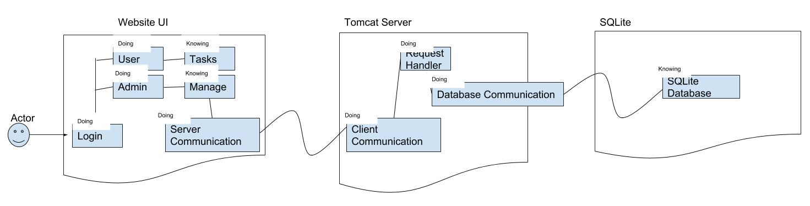

Domain Model
--------------

System Design
--------------

As discussed in the part 1 of design document, we decided to implement the client/server architectural style for this system. We also have chosed MVC architure which gives us a lot of 
flexibitly in drawing out relationships between different components. We are using Java Spring MVC controllers to process the form data and does all work with it and then add it to 
model whih then used by Spring MVC view templates to display the results. For example, for users problem 
we generally have two sub components 
User{
	name, email, role, work phone, etc. 
}. And 
Admin extends User {} but role is Admin (Admin is a user)
Similarly Manager and Team Employee/Member are Users (extends User) with their respective roles.
Then we have Company{
	All company information
	
	//Here Admin is a User Specified by company and it depends on User Class to define Admin
	--> Dependency User (Admin )
}
Then we have controllers such as UserRegistrationController which uses Validator classes to verify user attributes which then depends on User Object to access data to validate and then
if validation is right then it will send the User information to the database and then sends model to Spring MVC view templates to display the successful or error message depending
on whether it passed the validation and added User object successfully to database or not. 
This relationship and responsibilities of validation and User accesses is same for LoginController except that it now access the database to read and not to write to it. 
There are also some classes that we haven't come across yet but we will know about them as we proceed in the development process. 
For Task problems,
We have Task Class which contains attributes describing tasks which then depends User class which provides it information about the team or department that this task belongs to.
We have ScheduleTasks class which depends on PrioritizeTasks class to get information about task priorities which then depends on Task object itself to access task's attributes such
as priority, start and stop times, etc.
Task class also depends on the ManageTasks class which serves as a communication channel between user's proposed tasks and managers of that team that have rights to manage tasks.
For example, if manager approves the given task for his/her team then ManageTasks will be notified about this which then will talk to Task object to change its status attribute to 
approved, so the team can start working on that task.
Finally, these all we have so far for our system design.

Algorithms and Data Structures
------------------------------
To optimize our performace on managing tasks and users, we have decided to use various algorithms and data structures to optimize the performance of many fucntionalities in the system.
Here for our data model, we are separating the users and tasks as two problems to solve for this system. For user data model, we have a company and its specified admin, and then 
managers of different teams, and then members of those different teams. For data model, we are creating user model/object which contains all necessary information about an employee in 
the company and role and title fields in user model acts to differentiate between admin, managers, and team members. Further, this user model is injected as dependency to Company model
which has information about the company and its users as in the database we have different table of users of different companies( For example, if company is google then table with name 
"GoogleUsers" is created in the database, and then all columns are just attributes about users (name, role, email, etc..) and each row is record of a user). For tasks,we have TaskModel 
which contains all of tasks attributes (task id, task priority, task start and stop times, task progress, task description, which team this task belongs to). Task ID is injected to the 
model in such a way that it differentiates the tasks of different teams in the one common task table in the database. One of the major problems that we come across is to schedule tasks 
as we have features that automatically schedules tasks for a given day, and for that we are using Priority Queue that uses task priority attribute of the task model to schedule tasks that
are scheduled for a given day. We are using Heaps (heap sort) to arrange the tasks based on their (times, priority, task size) when they are displayed in the list view. We are also
tryig to build a statistical model that learns how to prioritize tasks based on the data provided by users (we are not sure if we will be able to get this done). TM implementation before 
didn't really allow to flexibly use data structures as every interaction was being done directly with file, so these choices will allow us flexibly to manage program complexity and 
solve any issues we come up in the best and quick way possible. Thus, finally we are using different algorithmic approaches to solve different problems within our system.

User Interface Design and Implementation
-----------------------------------------
Describe whether and how you modified and implemented the initial screen mock-ups developed in assignment 1. If you didn't implement any mockups then, you will need to do so now.  
The textbook does not deal much with the GUI design. Excellent guidelines for GUI design can be found here: 
Sun Microsystems, Inc. Java Look and Feel Design Guidelines. Mountain View, CA, 1999. Available at: http://java.sun.com/products/jlf/ed2/book/ (Links to an external site.)Links to an external site.
"Ease-of-use" is generally considered the key characteristic of user interface. "Ease-of-use" should not be confused with a flashy interface, with lots of colors, picture, graphics, etc. On the contrary, you should avoid flashy user interfaces. "Ease-of-use" means that interface is intuitive, easy to understand and operate, without having to ask many questions or read voluminous documentation. A minimal user interface that is well organized should be sufficient. You should strive to minimize the user effort, thus maximizing the "ease-of-use".

Progress Report and Plan of Work
Progress Report
----------------
|Front End | The user interface on our web application is mostly done. We currently have the front page introducing out site, and we have the sign in and log in pages ready to hook up to the data base. We still need to create the interface where the user will interact with our program. These tasks will be done when the backend is ready to be hooked up.|

|Back End | |

What use cases have been implemented?
------------------------------------- 
Use Case #6 Create Account/Login:
* interface is ready to be hooked up to the back end/ database

What is already functional, what is currently being tackled?
	*Currently the website is cosmetically intact, it is visually ready.
	*Some adjustments need to be made with the javascript.

Plan of Work
------------

 | Week| Task |
|--|--|
| Current(0) | Finish front-end views; Complete base-level product classes; Complete JUnit test functions for said classes |
| 1 | Implement back-end to front-end with base level product |
| 2 | Finish other necessary classes/test cases|
| 3 | Housekeeping| 

Breakdown of Responsibilities
----------------------------

Our responsiblities have been divided into two general groups: front-end and back-end.

The back-end team is Matt and Akshar; whereas the front-end team is Singh, Tina, and Jessica.

Currently, Matt is responsible for developing test cases for the classes Akshar is working on. All of the front-end team are working together using HTML, bootstrap, and JavaScript in order for us to connect the back-end. Once we have all of these items completed we will be splitting up the classes to each group member. This is our top task for our current week.

Who will coordiante the integration?
-------------------------------------

Akshar

Who will perform the testing of the integrated system?
---------------------------------------------------------

Matt will be developing JUnit tests for each of the classes implemented by the rest of the team.
